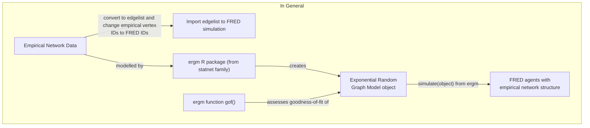
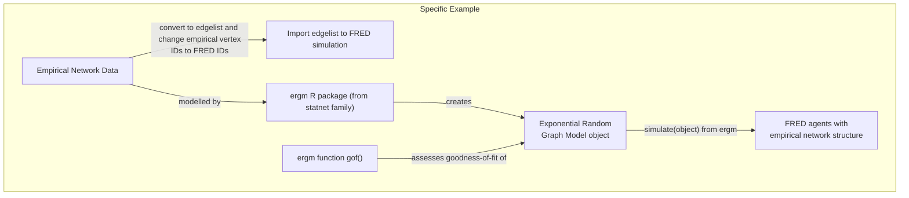

# ERGM-for-FRED
Modelling empirical networks for importing to FRED

```mermaid
flowchart TB
  subgraph In General
    A1["Empirical Network Data"]-- "convert to edgelist and \n change empirical vertex IDs to FRED IDs" -->B1b["Import edgelist to FRED simulation"];
    A1 -- modelled by -->B1a["ergm R package (from statnet family)"];
    B1a -- creates -->C1["Exponential Random \n Graph Model object"];
    D1["ergm function gof()"] -- assesses goodness-of-fit of -->C1;
    C1 -- "simulate(object)" from ergm --> E1["FRED agents with \n empirical network structure"];
  end
```

```mermaid
flowchart TB
  subgraph Specific Example
    A2["Empirical Network Data"]-- "convert to edgelist and \n change empirical vertex IDs to FRED IDs" -->B2b["Import edgelist to FRED simulation"];
    A2 -- modelled by -->B2a["ergm R package (from statnet family)"];
    B2a -- creates -->C2["Exponential Random \n Graph Model object"];
    D2["ergm function gof()"] -- assesses goodness-of-fit of -->C2;
    C2 -- "simulate(object)" from ergm --> E2["FRED agents with \n empirical network structure"];
  end
```
