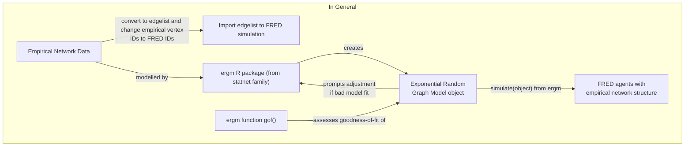

# ERGM-for-FRED
Modelling empirical networks for importing to FRED



```mermaid
flowchart TB
  subgraph Specific Example
    A2["Guclu et al. 2016 \n Contact Networks <a href='https://pubmed.ncbi.nlm.nih.gov/26978780/'>(link)</a>"]-- "convert to edgelist and \n change empirical vertex IDs to FRED IDs" -->B2b["Import edgelist to \n FRED simulation"];
    A2 -- preprocessed by -->B2a["preprocess_guclu.R"];
    B2a -- creates -->C2["`graphs`, a list of \n school contact networks"];
    D2["fit_ergm_workflow.Rmd"] -- plots and models -->C2;
    D2 -- makes -->E2["network models (ergm)"];
    F2["ergm function gof()"] -- assesses goodness-of-fit of -->E2;
    F2 -- prompts adjustment \n if bad model fit -->D2;
    E2 -- "simulate(ergm object)" using \n FRED agents as basis arg --> G2["FRED agents with \n empirical network structure"];
  end
```

## How to
fit_ergm_workflow.Rmd is a workflow for preprocessing, plotting, describing, and thresholding contact networks weighted by contact duration. It also fits [exponential random graph models (ERGM)](https://statnet.org/packages/) of empirical networks and shows how to evaluate binary (unweighted edge) networks. It finally takes FRED agents of your choosing as nodes 

## Related Work
[A method to create a synthetic population with social networks for geographically-explicit agent-based models](https://link.springer.com/article/10.1007/s43762-022-00034-1#Fig2) by Na Jiang et al. 2022 [Github](https://github.com/njiang8) (I think this was the person at CSSSA 2023 who made a synth pop). In this article, they used geographically explicit households and workplaces and generated small networks within them. Households with less than or equal to 5 people had complete networks generated within them.
