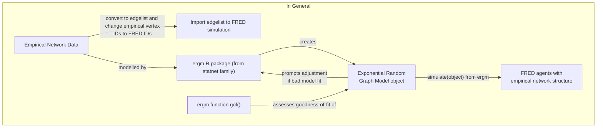

# ERGM-for-FRED
Modelling empirical networks for importing to FRED



```mermaid
flowchart TB
  subgraph Specific Example
    A2["Guclu et al. 2016 \n Contact Networks <a href='https://pubmed.ncbi.nlm.nih.gov/26978780/'>(link)</a>"]-- "convert to edgelist and \n change empirical vertex IDs to FRED IDs" -->B2b["Import edgelist to \n FRED simulation"];
    A2 -- preprocessed by -->B2a["preprocess_guclu.R"];
    B2a -- creates -->C2["`graphs`, a list of \n school contact networks"];
    D2["plot_guclu.R"] -- prints & writes plots of -->C2;
    C2 -- modelled by -->H2["model_guclu.R"];
    I2 -- prompts adjustment \n if bad model fit -->H2;
    H2 -- creates --> I2["ERGMs of School \n Contact Networks"];
    F2["ergm function gof()"] -- assesses goodness-of-fit of -->I2;
    I2 -- "simulate(ergm object)" \n from ergm package --> G2["FRED agents with \n empirical network structure"];
  end
```
